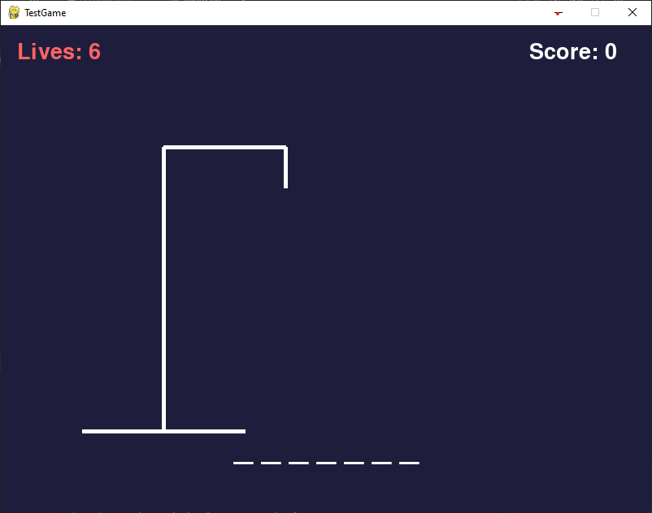
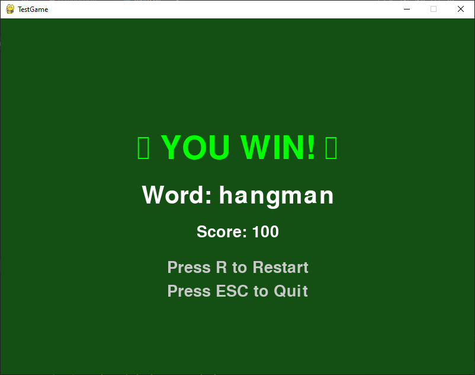

# 🎮 Hangman GUI Game

A Python-based Hangman game with a graphical interface, sound effects, and interactive gameplay. Perfect example of a beginner-to-professional Python GUI project.

---

## 📸 Screenshots

  



---

## 🚀 Features

- Interactive GUI built with Pygame
- Word selection and guessing logic
- Win/Lose sound effects
- Losing eyes animation
- Background music support
- Polished layout with class-based structure
- Progressive hangman drawing: body parts are added to the gallows with each incorrect guess

---

## 🛠 Tech Used

- Python 3
- Pygame

---

## ▶️ How To Run

1. Clone the repository:
```bash
git clone https://github.com/garvinedwards717_cloud/HangmanGUI.git
```
2. Navigate to the project folder:
```bash
cd HangmanGUI
```
3. Install dependencies:
```bash
pip install -r requirements.txt
```
4. Run the game:
```bash
python main.py
```

---

## 📌 Project Status

🚧 Currently being upgraded with additional features and improvements.