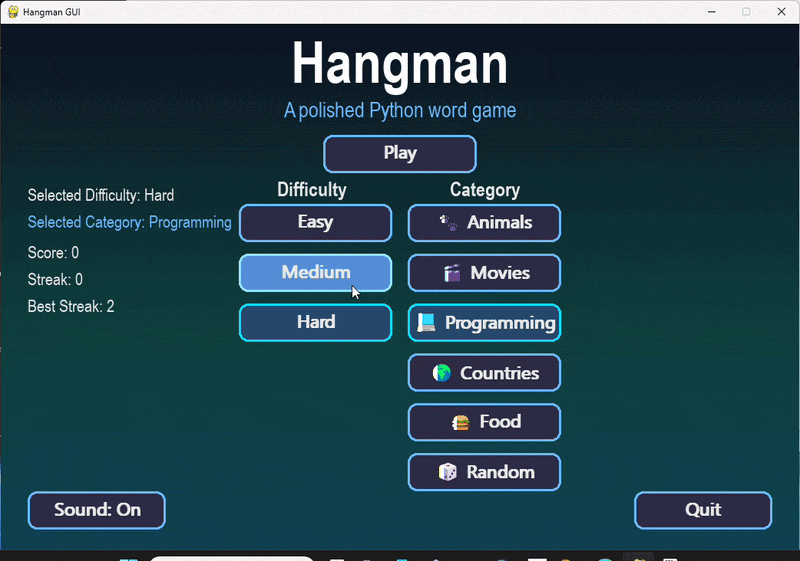

🎮 Hangman GUI

## 🎥 Demo

  

A polished Python Hangman word game built with Pygame, featuring a modern UI, selectable word categories, sound effects, and difficulty levels.

This project started as a beginner Python game and evolved into a modular, well-structured application with improved UI layout, assets, and gameplay features.

## ⬇ Download

Download the Windows version of Hangman here:

👉 https://github.com/garvinedwards717-cloud/Hangman-GUI/releases

✨ Features

Modern animated menu interface

🎯 Difficulty levels

Easy

Medium

Hard

🗂 Word categories

Animals 🐾

Movies 🎬

Programming 💻

Countries 🌍

Food 🍔

Random 🎲

🔊 Sound system

Background music

Correct guess sound

Wrong guess sound

Win sound

Lose sound

📊 Score tracking

🔥 Streak tracking

🏆 Best streak tracking

⌨️ Keyboard gameplay

🧩 Clean modular project structure

🎮 Controls## 📸 Screenshots

⌨️ Keyboard
Key	Action
A–Z	Guess letter
1	Easy difficulty
2	Medium difficulty
3	Hard difficulty
SHIFT	Return to menu
ENTER   Restart
🖱 Mouse

Click menu buttons

Select difficulty

Select category

Toggle sound

📁 Project Structure

Hangman-GUI
│
├─ src
│ ├─ main.py
│ ├─ ui.py
│ └─ game_logic.py
│
├─ sounds
│ ├─ background.mp3
│ ├─ correct.wav
│ ├─ wrong.wav
│ ├─ win.wav
│ └─ lose.wav
│
├─ screenshots
│ ├─ menu.png
│ ├─ gameplay.png
│ ├─ win.png
│ └─ lose.png
│
├─ requirements.txt
└─ README.md

⚙️ Installation

Clone the repository

git clone https://github.com/garvinedwards717-cloud/Hangman-GUI.git

cd Hangman-GUI

Create a virtual environment

python -m venv venv

Activate it

Windows

venv\Scripts\activate

Mac / Linux

source venv/bin/activate

Install dependencies

pip install pygame

Run the game

python src/main.py

🚀 Future Improvements

Possible upgrades:

📱 Mobile version

🏆 Leaderboard system

📦 More word packs

⚙️ Settings menu

🎨 Animated hangman drawing

📊 Game statistics

🛠 Technologies Used

Python

Pygame

Git

GitHub

👨‍💻 Author

Garvin Edwards

📜 License

This project is open source and available under the MIT License.